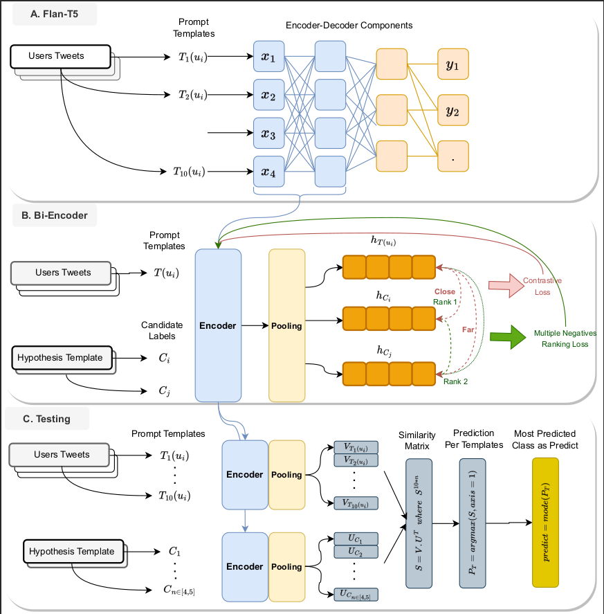

# Leveraging Large Language Models with Multiple Loss Learners for Few-Shot Author Profiling

This repository contains the code and data for the paper "Leveraging Large Language Models with Multiple Loss Learners for Few-Shot Author Profiling" by Hamed Babaei Giglou, Mostafa Rahgouy, Jennifer D’Souza, Milad Molazadeh Oskuee, Hadi Bayrami Asl Tekanlou, and Cheryl D Seals. The paper was presented at the Fourteenth International Conference of the CLEF Association (CLEF 2023).

## Abstract

The objective of author profiling (AP) is to study the characteristics of authors through the analysis of how language is exchanged among people. Studying these attributes sometimes is challenging due to the lack of annotated data. This indicates the significance of studying AP from a low-resource perspective. This year at AP@PAN 2023 the major interest raised in profiling cryptocurrency influencers with a few-shot learning technique to analyze the effectiveness of advanced approaches in dealing with new tasks from a low-resource perspective.



## Contents

- `dataset/`: Contains the datasets used in the paper.
- `assets/`: Contains the models checkpoints used in the paper.
- `visualization/`: Contains the code for the visualizing expriments in the paper.
- `results/`: Contains the results of the experiments.

## Requirements

- Python 3.8 or higher
- PyTorch 1.9.x or higher
- Transformers 4.3.x or higher

## Usage

1. Clone the repository:

```
https://github.com/HamedBabaei/author-profiling-pan2023
cd author-profiling-pan2023
```

2. Install the required packages:

```
pip install -r requirements.txt
```

3. Run the experiments:
   1. Inference fsl
    ```bash
    bash inference_fsl.sh 
    ```
   2. Inference fsl
   ```bash
   bash inference_fsl_biencoder.sh 
   ``` 
   3. Baseline (random)
    ```bash
    bash random_baseline.sh 
    ```
   4. Baseline (Zero Shot)
   ```bash
   bash zero_shot_baseline.sh
   ``` 
   5. Train & Test SBERT
    ```bash
    bash train_test_runner_sbert.sh
    ```
   6. Train & Test flanT5
   ```bash
   bash train_test_runner_flan_t5.sh 
   ```  


## Contributions

Contributions to this repository are welcome! If you find any issues or have suggestions for improvements, please feel free to open an issue or submit a PR.

### How to Contribute

1. Fork the repository.
2. Create a new branch for your changes: `git checkout -b my-new-branch`
3. Make your changes and commit them: `git commit -am 'Add some feature'`
4. Push to the branch: `git push origin my-new-branch`
5. Submit a pull request.

### Guidelines

- Please make sure your code follows the PEP 8 style guide.
- Include tests for any new functionality you add.
- Make sure your code is well-documented.
- If you're adding a new dataset, please include a README file with information about the dataset and its source.
- If you're adding a new model or experiment, please include a README file with information about the model or experiment and how to run it.

Thank you for your contributions!

## Citation

If you use this code or data in your research, please cite the following paper:


```bib
@InProceedings{giglou:2023,
  author =                   {Hamed Babaei Giglou, Mostafa Rahgouy, Jennifer D’Souza, Milad Molazadeh Oskuee , Hadi Bayrami Asl Tekanlou and Cheryl D Seals},
  booktitle =                {{CLEF 2023 Labs and Workshops, Notebook Papers}},
  crossref =                 {pan:2023},
  editor =                   {Hamed Babaei Giglou, Mostafa Rahgouy, Jennifer D’Souza, Milad Molazadeh Oskuee , Hadi Bayrami Asl Tekanlou and Cheryl D Seals},
  month =                    sep,
  publisher =                {CEUR-WS.org},
  title =                    {{Leveraging Large Language Models with Multiple Loss Learners for Few-Shot Author Profiling}},
  year =                     2023
}
```